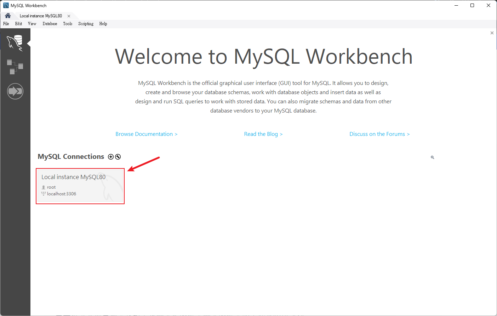

# MySQL 安裝指南

本指南旨在協助讀者在不同操作系統上安裝 MySQL，這是一個廣泛使用的關係型數據庫管理系統。

## 目錄

- [Windows 系統](#windows-系統)

### 預計新增的安裝指南

- macOS 系統
- Linux 系統

## Windows 系統

### 步驟 1: 下載 MySQL 安裝檔

1. 訪問 [MySQL 官方 Windows 下載頁面](https://dev.mysql.com/downloads/installer/)。
2. 選擇適合 Windows 的安裝檔，並下載。

   

### 步驟 2: 安裝 MySQL

請按照以下子步驟安裝 MySQL：

- **開始安裝**：雙擊下載的安裝檔，選擇「自定義」設置類型，然後點擊「下一步」。

  

- **選擇元件**：確保選擇了「MySQL Server」、「MySQL Workbench」和「MySQL Shell」，然後點擊「下一步」。

  

- **安裝元件**：點擊「執行」安裝三個元件，並等待安裝完成。

  

- **產品配置**：點擊「下一步」進行 MySQL 伺服器的配置。

  

- **TCP/IP 連接**：此步驟將為 MySQL 伺服器應用 TCP/IP 連接。請確保你的端口號設定為 3306。如果這個端口號已經被系統中的其他服務使用，你可以選擇一個不同的號碼。但要注意，如果你選擇了一個不同的端口號，後續在配置連接或其他相關設定時，也要使用這個新端口號。

  

- **身分驗證**：這裡我們會遇到一個關於身分驗證插件的選擇。對於 MySQL 8.0 及以上的版本，一個新的默認身分驗證插件(「Use Strong Password Encryption」)已經被引入。這個新插件提供了更強的安全性，但可能會與某些舊版的客戶端軟件（包括某些版本的 Node.js 模塊）不完全兼容。如果你的應用系統中包含這些軟件，或者你想要保持與舊版 MySQL 伺服器的兼容性，你可以選擇「Use Legacy Authentication Method」。否則，為了得到更好的安全性，建議使用新的默認插件。

  

- **賬戶和角色**：設置 root 用戶的密碼，並記住它，以便後續使用。在此我們設定的密碼為 `root`，但你可以根據需要設定自己的密碼。

  

- **Windows 服務**：確保 MySQL 作為系統服務運行，並點擊「下一步」。

  

- **完成安裝**：檢查所有配置步驟的狀態，確保它們都是綠色複選框，然後點擊「完成」。

  

### 步驟 3: 驗證安裝

- 開啟 MySQL Workbench 並嘗試連接到你剛剛安裝的數據庫。

- 你將使用在安裝過程中設置的 `root` 用戶和密碼。如果你按照這個指南設置，密碼應該是 `root`。你也可以選擇記住密碼，以便於未來更輕鬆地連接。
  

### 步驟 4: 配置環境變數（可選）

你可能需要將 MySQL 的 bin 目錄添加到系統的 PATH 環境變數中。這允許你在命令行界面中運行 MySQL 命令而不需要指定其完整路徑。通常這些路徑會是：

- MySQL Server：`C:\Program Files\MySQL\MySQL Server 8.0\bin`
- MySQL Shell：`C:\Program Files\MySQL\MySQL Shell 8.0\bin`

## 結語

現在，你應該已經成功安裝並配置了 MySQL！如果你在安裝過程中遇到任何問題或有任何其他疑問，請隨時聯繫我們。

希望這個安裝指南對你有所幫助！
