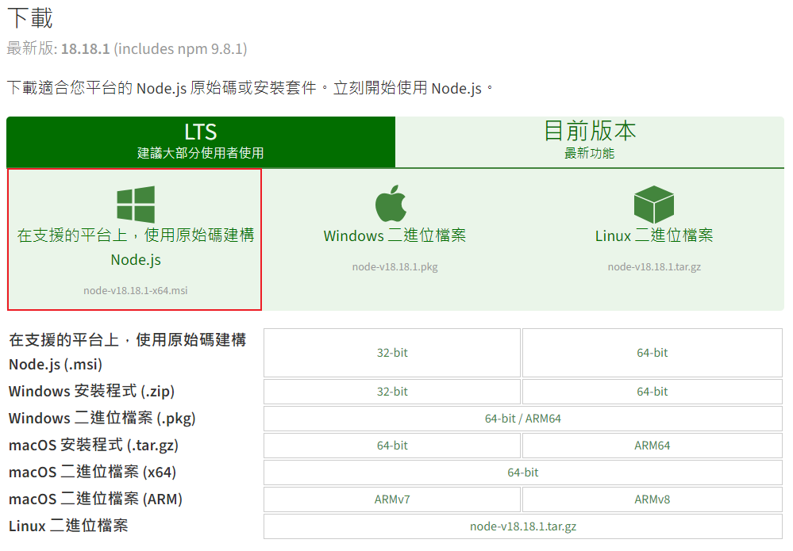

# Node.js 安裝指南

Node.js 是一個開放源碼的跨平台 JavaScript 運行時環境，它允許開發者在伺服器端運行 JavaScript。這個指南將引導你完成 Node.js 在不同操作系統上的安裝過程。

## 目錄

- [Windows 系統](#windows-系統)

## 預計新增的安裝指南

- [macOS 系統](#macos-系統)
- [Linux 系統](#linux-系統)

## Windows 系統

### 步驟 1: 下載安裝檔

- 訪問 [Node.js 官方繁體中文網站](https://nodejs.org/zh-tw/download)。
- 下載適合 Windows 系統的安裝檔。



### 步驟 2: 安裝過程

- 開啟剛下載的安裝檔。
- 遵循安裝精靈的步驟來完成安裝（安裝過程中的選項不需要特別變更）。
- 依據 2023/10/12 的測試，當前的安裝檔應該已經會自動設定環境變數。

### 步驟 3: 驗證安裝

- 打開命令提示符（cmd）。
- 輸入以下命令來確認 Node.js 和 npm 是否已經正確安裝，並檢視其版本號：

```shell
node -v
npm -v
```
