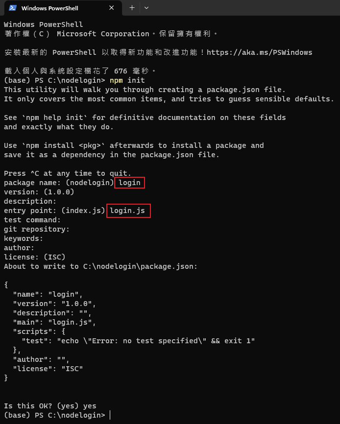
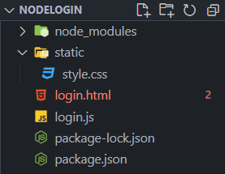
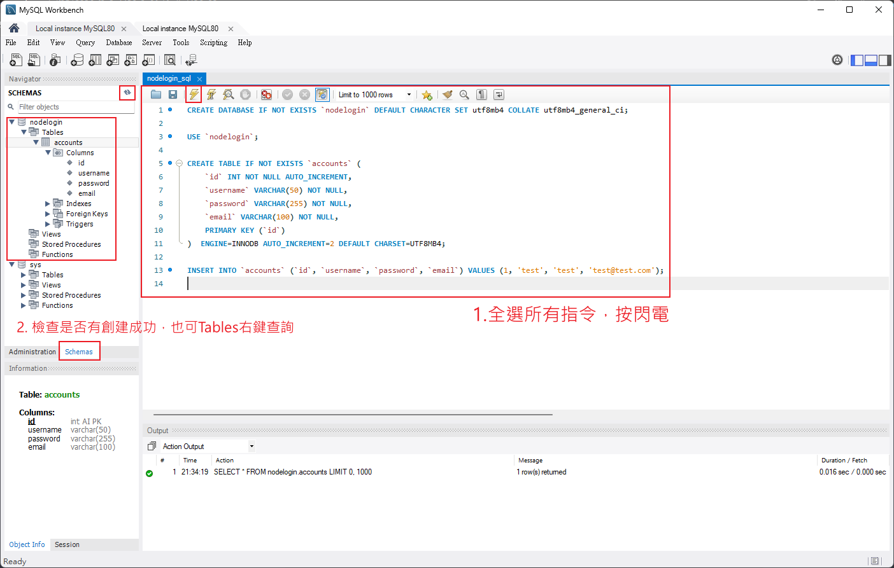
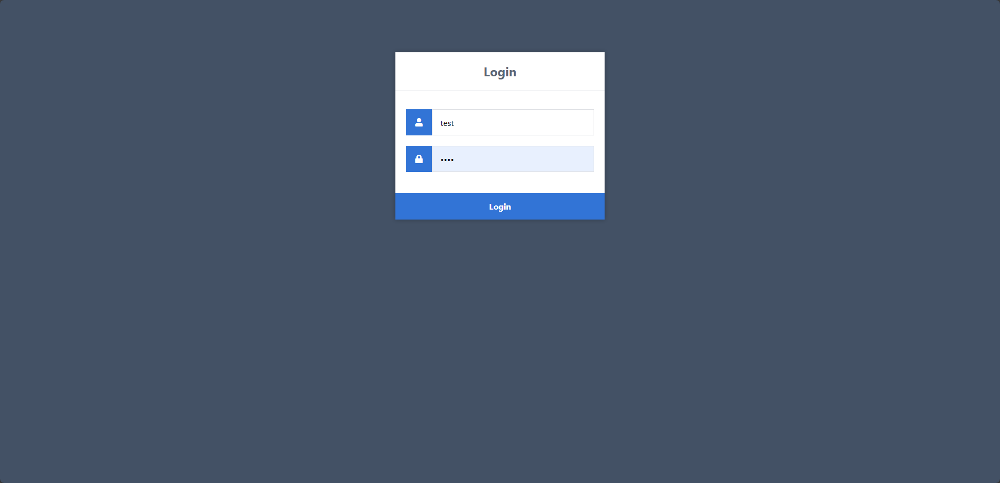

# 使用 Node.js 和 MySQL 創建登入系統

本教學將指導你使用 Node.js 和 MySQL 建立一個基本登入系統。

## 目錄

1. [選擇 Node.js 的理由](#1-選擇-nodejs-的理由)
2. [入門指南](#2-入門指南)
   - 2.1. 學習目標
   - 2.2. 前置要求
   - 2.3. 環境設置與檔案結構
3. [CSS 樣式登入表單](#3-css-樣式登入表單)
4. [HTML 登入模板建立](#4-html-登入模板建立)
5. [使用 Node.js 構建登入應用](#5-使用-nodejs-構建登入應用)
6. [結論](#6-結論)

## 1. 選擇 Node.js 的理由

Node.js 是一個強大的開源伺服器環境，使用 JavaScript 作為其主要的腳本語言。由於越來越多的開發者開始認識到 Node.js，它在 Web 應用開發領域的受歡迎程度也在不斷上升。如果你打算為未來的 Web 開發提升技能，強烈建議你深入學習 Node.js。

與 PHP 不同，Node.js 不依賴於 Apache 或 Nginx，因為它本身就是一個運行環境。如果你已經對 JavaScript 有所了解，你將會發現使用 Node.js 開發應用非常便利且易於適應。

## 2. 入門指南

在開始開發 Node.js 登入系統之前，我們需要安裝必要的軟體與套件，並建立適當的應用程式結構。

### 2.1. 學習目標

- 建立並連接 MySQL 數據庫。
- 使用 Node.js 和 Express 處理 GET 和 POST 請求。
- 使用 HTML 和 CSS3 設計登入表單。
- 驗證輸入的數據是否有效。
- 使用會話確認用戶是否已經登入。

### 2.2. 前置要求

- MySQL Server >= 8.0
- Node.js
- Express
- Express Sessions
- MySQL for Node.js

確保在本地運行此項目時，Node.js 和 MySQL 已經被正確安裝。若需安裝指南，請參見：

- [Node.js 安裝教程](docs/installation-guide-nodejs.md)
- [MySQL 安裝教程](docs/installation-guide-mysql.md)

### 2.3. 設置與檔案結構建立（全新搭建教學）

> :bulb: **提示**: 如果你希望直接使用現成的檔案結構及代碼，可以直接從我們的 [login-system-node-mysql](../README.md) 下載或克隆原始碼。否則，如果你希望從零開始建立你的項目，請按照下面的步驟進行。

請根據以下步驟，進行開發環境的設置及專案檔案結構的建立：

1. **創建新目錄：**

   - 在你的電腦中選擇一個適合的位置，創建一個名為 `nodelogin` 的新目錄。

2. **命令行導航：**

   - 打開命令行工具（以管理員身份運行），並導航至剛創建的新目錄：

   ```shell
   cd c:\\nodelogin
   ```

3. **NPM 初始化：**

   - 運行下列命令並依提示進行設置（包名選擇 `login`，入口點選擇 `login.js`）：

   ```shell
   npm init
   ```

   

4. **安裝必要的 NPM 套件：**

   - 根據第 2.2 節的需求，運行對應的命令來安裝所需的 NPM 套件。<bar>
     注意!! 如果是安裝 MySQL8.0 及以上的版本，選擇默認的新的默認身分驗證插件(「Use Strong Password Encryption」)，請使用`npm install mysql2 --save`，而不是`npm install mysql --save`。

   ```shell
   npm install express --save
   npm install express-session --save
   npm install mysql2 --save
   ```

5. **建立檔案結構：**
   - 在 `nodelogin` 目錄下創建文件 `login.html` 和 `login.js`，以及一個名為 `static` 的子目錄。在 `static` 目錄下創建 `style.css` 文件。

預期的檔案及目錄結構如下：

```Markdown
nodelogin
|-- login.html
|-- login.js
\-- static
    |-- style.css
```



### 2.4. 在 MySQL 中創建數據表

在我們開始 Node.js 應用程式的開發前，先來建立一個存放用戶資訊的 MySQL 數據庫和表格。下面的 SQL 腳本將創建一個名為 `nodelogin` 的數據庫，並在其中建立一個名為 `accounts` 的表格，以存儲用戶名（`username`）、密碼（`password`）和電郵地址（`email`）。

請在你的 MySQL Workbench 管理界面中執行以下 [SQL 腳本](src/nodelogin_sql.sql)：

```sql
CREATE DATABASE IF NOT EXISTS `nodelogin` DEFAULT CHARACTER SET utf8mb4 COLLATE utf8mb4_general_ci;

USE `nodelogin`;

CREATE TABLE IF NOT EXISTS `accounts` (
    `id` INT NOT NULL AUTO_INCREMENT,
    `username` VARCHAR(50) NOT NULL,
    `password` VARCHAR(255) NOT NULL,
    `email` VARCHAR(100) NOT NULL,
    PRIMARY KEY (`id`)
)  ENGINE=INNODB AUTO_INCREMENT=2 DEFAULT CHARSET=UTF8MB4;

INSERT INTO `accounts` (`id`, `username`, `password`, `email`) VALUES (1, 'test', 'test', 'test@test.com');
```



這個 SQL 腳本做了幾件事：

1. 確保數據庫存在： 如果 nodelogin 數據庫不存在，創建它。
2. 選擇數據庫： 選擇 nodelogin 數據庫作為後續操作的目標。
3. 確保表格存在： 如果 accounts 表格不存在，創建它，並定義一些列來存儲用戶資訊。
4. 插入測試用戶： 在 accounts 表格中插入一個測試用戶。

## 3. HTML 登入模板建立

我們將從建立一個基本的 HTML 登入模板開始，並將透過 CSS 加入視覺樣式。完整程式碼可在 [style.css](src/login.html) 中找到。

```HTML
<!DOCTYPE html>
<html>
  <head>
    <meta charset="utf-8" />
    <meta name="viewport" content="width=device-width,minimum-scale=1" />
    <title>Login</title>
    <link
      rel="stylesheet"
      href="https://use.fontawesome.com/releases/v5.7.1/css/all.css"
    />
    <link href="style.css" rel="stylesheet" type="text/css" />
  </head>

  <body>
    <div class="login">
      <h1>Login</h1>
      <form action="/auth" method="post">
        <label for="username">
          <i class="fas fa-user"></i>
        </label>
        <input
          type="username"
          name="username"
          placeholder="Username"
          id="username"
          required
        />
        <label for="password">
          <i class="fas fa-lock"></i>
        </label>
        <input
          type="password"
          name="password"
          placeholder="Password"
          id="password"
          required
        />
        <input type="submit" value="Login" />
      </form>
    </div>
  </body>
</html>
```

### 3.1. 元素解析

- **Form** — 我們使用 `form` 元素來提交數據到我們的 Node.js 應用程式。其中的 `action` 屬性將指向我們稍後將創建的 `auth` 路由（POST 請求）。

- **Input (username)** — 用於捕獲用戶的用戶名。此外，還聲明了 `required` 屬性，以確保該字段是必填的。

- **Input (password)** — 用於捕獲用戶的密碼，並使用 `required` 屬性確保用戶必須填寫。

- **Input (submit)** — 一個提交表單的按鈕，允許用戶將用戶名和密碼提交給伺服器。

### 3.2. 登入模板的運作

登入模板允許用戶輸入其詳細信息，而我們將使用 Node.js 來驗證這些詳細信息。我們將使用 POST 請求來獲取詳細信息，然後在我們的 Node.js `auth` 路由中處理它們。

當用戶填寫表單並點擊"Login"按鈕時：

1. **用戶名和密碼提交**：用戶輸入的用戶名和密碼將通過表單的`action`屬性中定義的路由（在這種情況下是`/auth`）被提交到我們的 Node.js 應用程式。
2. **身份驗證**：我們的應用程式將通過與數據庫中存儲的資訊進行比較，來驗證這些登入憑據的有效性。
3. **響應**：根據用戶提供的憑據是否匹配，我們的應用程式將相應地重定向用戶或顯示一個錯誤消息。

在接下來的章節中，我們將深入探討如何在 Node.js 中實現這些步驟。

## 4. CSS 樣式登入表單

將以下 CSS 規則添加到你的 style.css 文件中，以便為登入頁面提供一個乾淨而現代的外觀。完整程式碼可在 [style.css](src/static/style.css) 中找到。

```CSS
* {
  box-sizing: border-box;
  font-family: -apple-system, BlinkMacSystemFont, "segoe ui", roboto, oxygen,
    ubuntu, cantarell, "fira sans", "droid sans", "helvetica neue", Arial,
    sans-serif;
  font-size: 16px;
}

body {
  background-color: #435165;
}

.login {
  width: 400px;
  background-color: #ffffff;
  box-shadow: 0 0 9px 0 rgba(0, 0, 0, 0.3);
  margin: 100px auto;
}

.login h1 {
  text-align: center;
  color: #5b6574;
  font-size: 24px;
  padding: 20px 0 20px 0;
  border-bottom: 1px solid #dee0e4;
}

.login form {
  display: flex;
  flex-wrap: wrap;
  justify-content: center;
  padding-top: 20px;
}

.login form label {
  display: flex;
  justify-content: center;
  align-items: center;
  width: 50px;
  height: 50px;
  background-color: #3274d6;
  color: #ffffff;
}

.login form input[type="password"],
.login form input[type="username"] {
  width: 310px;
  height: 50px;
  border: 1px solid #dee0e4;
  margin-bottom: 20px;
  padding: 0 15px;
}

.login form input[type="submit"] {
  width: 100%;
  padding: 15px;
  margin-top: 20px;
  background-color: #3274d6;
  border: 0;
  cursor: pointer;
  font-weight: bold;
  color: #ffffff;
  transition: background-color 0.2s;
}

.login form input[type="submit"]:hover {
  background-color: #2868c7;
  transition: background-color 0.2s;
}
```

## 5. 利用 Node.js 建立登入應用程式

在這一部分，我們將探討如何使用 `Node.js`、`Express` 和 `MySQL` 建立一個基本的登入應用程式。完整的代碼可在 [login.js](src/login.js) 中找到，而在這裡，我們將對核心片段進行解釋。

### 5.1. 初始化及設定

```JavaScript
const mysql = require("mysql2");
const express = require("express");
const session = require("express-session");
const path = require("path");
```

在上面的代碼塊中，我們引入了所需的模組並初始化了 Express 應用程式。mysql2 用於與 MySQL 數據庫交互，express 用於建立 Web 應用程式，express-session 用於處理會話數據，而 path 用於處理文件和目錄的路徑。

### 5.2. 設定資料庫連接

```JavaScript
const connection = mysql.createConnection({
  host: "localhost",
  user: "root",
  password: "root",
  database: "nodelogin",
});
```

這個部分設定了我們將如何連接到 MySQL 數據庫。參數 host, user, password, 和 database 指定了連接的細節。

### 5.3. Express 應用程式設定

```JavaScript
const app = express();

app.use(
  session({
    secret: "secret",
    resave: true,
    saveUninitialized: true,
  })
);
app.use(express.json());
app.use(express.urlencoded({ extended: true }));
app.use(express.static(path.join(__dirname, "static")));
```

在這裡，我們配置 Express 應用程式使用各種中間件來處理會話、JSON 輸入、URL 編碼的數據，以及靜態文件的服務。

### 5.4. 路由處理

5.4.1. 主頁路由

```JavaScript
// http://localhost:3000/
app.get("/", function (request, response) {
  // Render login template
  response.sendFile(path.join(__dirname + "/login.html"));
});
```

當用戶訪問應用程式的主頁 (/) 時，伺服器將發送 login.html 文件作為響應。

5.4.2. 認證路由

```JavaScript
// http://localhost:3000/auth
app.post("/auth", function (request, response) {
  // Capture the input fields
  let username = request.body.username;
  let password = request.body.password;
  // Ensure the input fields exists and are not empty
  if (username && password) {
    // Execute SQL query that'll select the account from the database based on the specified username and password
    connection.query(
      "SELECT * FROM accounts WHERE username = ? AND password = ?",
      [username, password],
      function (error, results, fields) {
        // If there is an issue with the query, output the error
        if (error) throw error;
        // If the account exists
        if (results.length > 0) {
          // Authenticate the user
          request.session.loggedin = true;
          request.session.username = username;
          // Redirect to home page
          response.redirect("/home");
        } else {
          response.send("Incorrect Username and/or Password!");
        }
        response.end();
      }
    );
  } else {
    response.send("Please enter Username and Password!");
    response.end();
  }
});
```

當用戶提交登入表單時，這個路由處理 POST 請求到 /auth，並檢查提交的 username 和 password。

5.4.3. 主頁路由

```JavaScript
// http://localhost:3000/home
app.get("/home", function (request, response) {
  // If the user is loggedin
  if (request.session.loggedin) {
    // Output username
    response.send("Welcome back, " + request.session.username + "!");
  } else {
    // Not logged in
    response.send("Please login to view this page!");
  }
  response.end();
});
```

如果用戶已登入，/home 路由將歡迎他們。否則，它將提示他們登入。

### 5.5. 啟動伺服器

```JavaScript
app.listen(3000);
```

最後，我們要求應用程式在端口 3000 上啟動伺服器。現在你可以在 http://localhost:3000/ 訪問你的應用程式。

## 6. 啟動應用程式

一旦所有的設置都完成，就可以啟動我們的 Node.js 應用程式。請打開你的命令行工具，並執行以下命令：

```shell
node login.js
```

現在，如果你在瀏覽器中導航到 http://localhost:3000/，你應該能夠看到一個整潔的登入表單，如下所示：



## 7. 結論與下一步

恭喜你！現在你已經建立了一個基本的 Node.js 登入系統。儘管此系統是基礎版，並不適合生產環境，但它提供了一個不錯的起點，並且能夠在你的開發項目中用作一個學習的模型或基本的框架。
